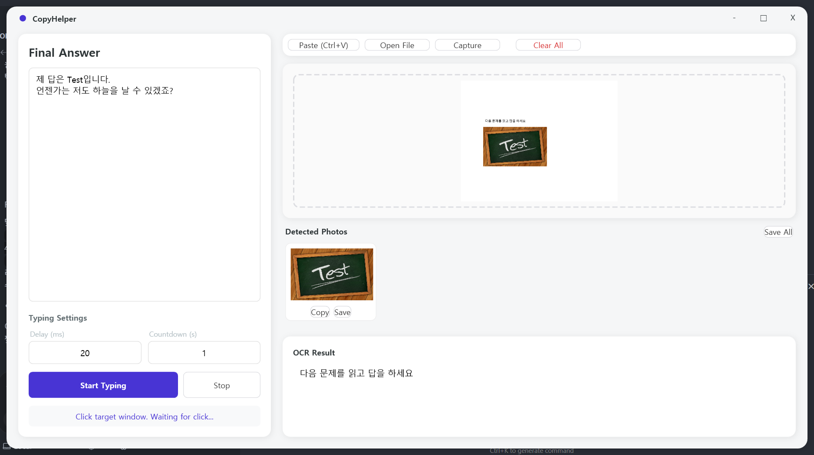

# CopyHelper

학생이 화면 캡처만 붙여넣으면 OCR과 이미지 분리를 자동으로 수행하고, 답안을 사람이 치는 것처럼 입력해 주는 WPF 앱입니다.

## 지원 기능
- 이미지 입력: Ctrl+V, 드래그 앤 드롭, 파일 선택, 오버레이 캡처
- 자동 분리: 이미지 안의 이미지(사각형 영역) 검출 후 썸네일로 표시
- OCR 텍스트 추출: 한/영 인식 결과를 문단 형태로 출력
- 답안 작성: 좌측 에디터에서 최종 답안 작성
- 자동 타이핑: 대상 창 클릭 후 지연/카운트다운 기반으로 키 입력 전송
- 긴급 중지: ESC로 즉시 타이핑 중지
- 이미지 저장/복사: 개별 이미지 복사/저장, 전체 일괄 저장

## 학우들의 불편 해소 포인트
- 복잡한 복붙 과정 없이 캡처 한 번으로 텍스트/이미지 분리
- OCR 결과를 바로 편집해 답안 작성 시간을 단축
- 붙여넣기 불가 환경에서도 자동 타이핑으로 제출 가능
- 분리된 이미지들을 재사용 가능한 파일로 바로 확보

## 기본 사용 흐름
1. 화면 캡처를 붙여넣기 또는 캡처 버튼으로 입력
2. 자동 OCR/이미지 분리 결과 확인
3. 좌측 답안에 수정/작성
4. Start Typing → 대상 창 클릭 → 자동 입력

## 요구 사항
- Windows 10/11
- Windows OCR 언어팩(한국어) 설치 권장
