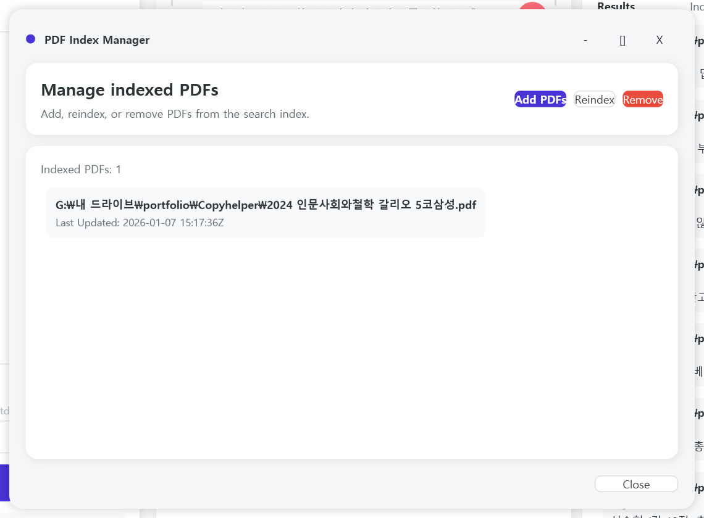

# 📋 CopyHelper

> **문제 화면 캡처 한 번으로 OCR, 이미지 분리, 자료 대조, 자동 타이핑까지!** > 복잡한 문제 풀이와 답안 작성을 혁신적으로 단축해주는 스마트 워크플로우 도구입니다.

---

## ✨ 핵심 기능 (Key Features)

### 🔍 스마트 인식 및 분석

* **다양한 이미지 입력**: `Ctrl+V`, 드래그 앤 드롭, 파일 선택은 물론 **오버레이 캡처**까지 완벽 지원합니다.
* **자동 요소 분리**: 이미지 검출 후 텍스트와 이미지를 자동으로 분리하여 썸네일로 표시합니다.
* **고성능 OCR**: 문제 인식 결과를 깔끔한 문단 형태의 텍스트로 추출합니다.

### 📂 강력한 검색 및 대조

* **PDF 인덱싱 및 컨에프(Ctrl+F)**: 기존에 업로드한 방대한 PDF 자료와 실시간으로 대조하여 유사 문제를 찾아냅니다.
* **이미지 자산 관리**: 문제에 포함된 이미지를 재사용 가능한 파일로 즉시 저장하거나 복사할 수 있습니다.

### ⌨️ 지능형 답안 작성 및 입력

* **통합 에디터**: 추출된 결과를 바탕으로 좌측 에디터에서 최종 답안을 즉시 편집합니다.
* **자동 타이핑 (Auto-Typing)**: 붙여넣기가 금지된 환경에서도 설정된 지연 시간/카운트다운 후 자동으로 키 입력을 전송합니다.
* **긴급 중지**: `ESC` 키 하나로 자동 타이핑을 즉시 중단할 수 있어 안전합니다.

---

## 🚀 불편 해소 포인트 (Pain Points Solved)

| 기존 방식의 문제점 | **CopyHelper의 솔루션** |
| --- | --- |
| 일일이 텍스트를 치거나 캡처 후 따로 저장 | **캡처 한 번으로 텍스트/이미지 즉시 자동 분리** |
| 복사가 금지된 웹사이트나 프로그램 | **OCR로 텍스트를 추출하여 자유롭게 활용 가능** |
| 붙여넣기가 차단된 시험/과제 환경 | **자동 타이핑 기능을 통한 안정적인 답안 제출** |
| 문제 속 이미지를 따로 저장하기 번거로움 | **재사용 가능한 이미지 파일로 즉시 확보** |

---

## 🛠 사용 흐름 (Workflow)

1. **입력**: 화면을 캡처하여 붙여넣거나 캡처 버튼을 클릭합니다.
2. **분석**: 자동 OCR 및 이미지 분리 결과를 확인합니다.
3. **검색**: 미리 인덱싱해둔 PDF 자료와 대조하여 정답을 찾습니다.
4. **편집**: 좌측 답안 창에서 내용을 수정하거나 작성합니다.
5. **입력**: `Start Typing` → 대상 창 클릭 → 카운트다운 후 **자동 입력 시작!**

---

## 📸 스크린샷

### 이미지 OCR 및 자료 대조

### 인덱싱 자료 관리

---

## 💻 요구 사항 (Requirements)

* **OS**: Windows 10 / 11 (64-bit)
* **권장**: Windows OCR 언어팩(한국어) 설치

---

## ✉️ Contact & Support

제품에 대한 문의사항이나 피드백은 아래의 연락처로 언제든 편하게 연락주세요!

* **Developer**: snowypainter
* **Email**: [snowypainter@gmail.com](mailto:snowypainter@gmail.com)
* **YouTube**: [데모 영상 시청하기](https://youtu.be/GJf3FkQ5LX8)

---

© 2024 CopyHelper. All rights reserved.